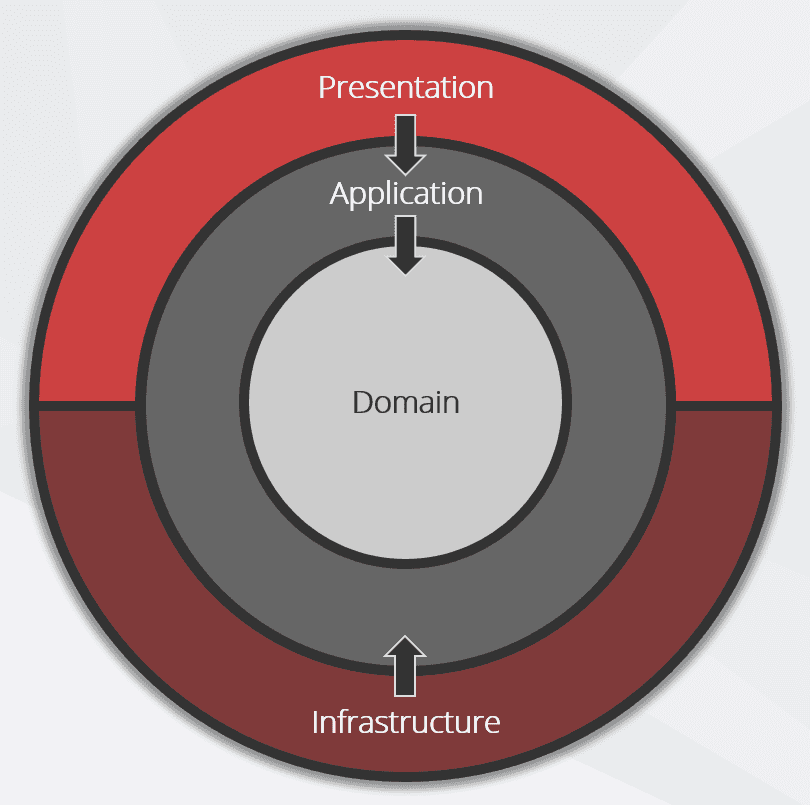

# C# scaffolding clean architecture

- I use this script when I'm programming in Linux (Ubuntu/Debian).
- To simplify and automate the creation of a clean architecture, using C# .Net (>= 6).
- It will create the Projects, Solution, gitignore file, readme file, dependencies between projects, dependencies into solution and enable CORS.
- I will try to add more automations.



### To run:
```
Giving permission: chmod u+x csharp-scaffolding-clean-architecture.sh
Running: ./csharp-scaffolding-clean-architecture.sh
```